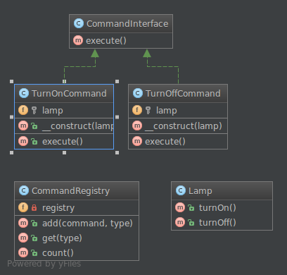

**Команда** (англ. **Command**) — поведенческий шаблон проектирования, который инкапсулирует запрос как объект, позволяя параметризовать клиентов с различными запросами, ставить запросы в очередь, логировать запросы и поддерживать отмену операций.

**Применение:**

* Когда нужно параметризовать объекты выполняемым действием.
* Когда нужно ставить запросы в очередь, выполнять их по расписанию или передавать по сети.
* Когда нужна поддержка отмены операций.
* **Command** позволяет отделить объект, инициирующий операцию, от объекта, который её выполняет.

```kotlin
// Интерфейс команды
interface Command {
    fun execute()
    fun undo()
}

// Получатель команд - устройство, которое выполняет реальную работу
class Light {
    private var isOn = false
    
    fun turnOn() {
        isOn = true
        println("Свет включен")
    }
    
    fun turnOff() {
        isOn = false
        println("Свет выключен")
    }
    
    fun getState() = if (isOn) "включен" else "выключен"
}

// Конкретные команды
class LightOnCommand(private val light: Light) : Command {
    override fun execute() {
        light.turnOn()
    }
    
    override fun undo() {
        light.turnOff()
    }
}

class LightOffCommand(private val light: Light) : Command {
    override fun execute() {
        light.turnOff()
    }
    
    override fun undo() {
        light.turnOn()
    }
}

// Пустая команда (Null Object pattern)
class NoCommand : Command {
    override fun execute() {}
    override fun undo() {}
}

// Инвокер - пульт управления
class RemoteControl {
    private val commands = mutableMapOf<Int, Command>()
    private var lastCommand: Command = NoCommand()
    
    fun setCommand(slot: Int, command: Command) {
        commands[slot] = command
    }
    
    fun pressButton(slot: Int) {
        val command = commands[slot] ?: NoCommand()
        command.execute()
        lastCommand = command
    }
    
    fun pressUndoButton() {
        lastCommand.undo()
    }
}
```

Пример использования:

```kotlin
fun main() {
    // Создаем получателя
    val light = Light()
    
    // Создаем команды
    val lightOn = LightOnCommand(light)
    val lightOff = LightOffCommand(light)
    
    // Создаем инвокера (пульт)
    val remote = RemoteControl()
    
    // Настраиваем команды на кнопки
    remote.setCommand(1, lightOn)
    remote.setCommand(2, lightOff)
    
    // Используем пульт
    println("Нажимаем кнопку 1:")
    remote.pressButton(1) // Свет включен
    
    println("Нажимаем кнопку 2:")
    remote.pressButton(2) // Свет выключен
    
    println("Нажимаем кнопку отмены:")
    remote.pressUndoButton() // Свет включен
}
```

Ожидаемый вывод:
```
Нажимаем кнопку 1:
Свет включен
Нажимаем кнопку 2:
Свет выключен
Нажимаем кнопку отмены:
Свет включен
```

Объяснение:
- `Command` - интерфейс, объявляющий метод для выполнения команды и её отмены.
- `Light` - получатель, который знает, как выполнить операции, связанные с запросом.
- `LightOnCommand` и `LightOffCommand` - конкретные команды, которые реализуют интерфейс Command.
- `RemoteControl` - инвокер, который обращается к команде для выполнения запроса.
- `NoCommand` - реализация паттерна Null Object для избежания проверок на null.
