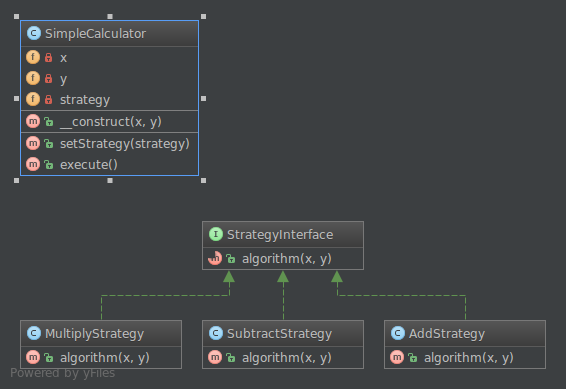

**Стратегия** (англ. **Strategy**) — поведенческий шаблон проектирования, предназначенный для определения семейства алгоритмов, инкапсуляции каждого из них и обеспечения их взаимозаменяемости. Это позволяет выбирать алгоритм путём определения соответствующего класса. Шаблон **Strategy** позволяет менять выбранный алгоритм независимо от объектов-клиентов, которые его используют.

```kotlin
// Интерфейс стратегии
interface StrategyInterface {
    fun algorithm(x: Int, y: Int): Int
}

// Конкретные реализации стратегий
class AddStrategy : StrategyInterface {
    override fun algorithm(x: Int, y: Int) = x + y
}

class SubtractStrategy : StrategyInterface {
    override fun algorithm(x: Int, y: Int) = x - y
}

class MultiplyStrategy : StrategyInterface {
    override fun algorithm(x: Int, y: Int) = x * y
}

// Класс калькулятора
class SimpleCalculator(private var x: Int, private var y: Int) {
    private var a: Int? = null
    private var strategy: StrategyInterface = AddStrategy() // стратегия по умолчанию

    fun setStrategy(strategy: StrategyInterface) {
        this.strategy = strategy
    }

    fun execute() {
        a = strategy.algorithm(x, y)
    }

    fun getResult(): Int? = a
}


Пример использования:

fun main() {
    val calculator = SimpleCalculator(10, 5)
    
    // Используем стратегию сложения
    calculator.setStrategy(AddStrategy())
    calculator.execute()
    println("10 + 5 = ${calculator.getResult()}") // 15

    // Используем стратегию вычитания
    calculator.setStrategy(SubtractStrategy())
    calculator.execute()
    println("10 - 5 = ${calculator.getResult()}") // 5

    // Используем стратегию умножения
    calculator.setStrategy(MultiplyStrategy())
    calculator.execute()
    println("10 * 5 = ${calculator.getResult()}") // 50
}