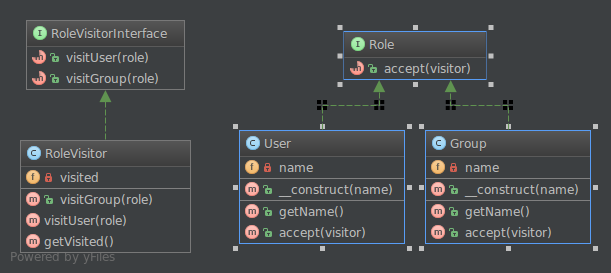

**Посетитель** (англ. **Visitor**) — поведенческий шаблон проектирования, основным назначением которого является добавление доп. функционала для объектов разных классов, не изменяя их. Для этого данный функционал переноситься в сам класс **Посетителя**.

**Применение:**

* В структуре присутствуют объекты многих классов с различными интерфейсами, и вы хотите выполнять над ними операции, зависящие от конкретных классов.
* **Посетитель** позволяет добавить одну и ту же операцию в различные типы объектов, которые он посещает.
* Над объектами, входящими в состав структуры, надо выполнять разнообразные, не связанные между собой операции и вы не хотите “засорять” классы такими операциями.
* **Посетитель** позволяет объединить родственные операции, поместив их в один класс. Если структура объектов является общей для нескольких приложений, то шаблон **посетитель** позволит в каждое приложение включить только относящиеся к нему операции.

Мы реализуем паттерн посетитель в соответствии с предоставленной структурой.
Для красивого отображения в Markdown будем использовать форматирование кода.
Код на Kotlin:
```kotlin
// Интерфейс посетителя
interface RoleVisitorInterface {
    fun visitUser(user: User)
    fun visitGroup(group: Group)
}
// Базовый интерфейс для элементов (User и Group)
interface Role {
    fun accept(visitor: RoleVisitorInterface)
}
// Класс User
class User(val name: String) : Role {
    override fun accept(visitor: RoleVisitorInterface) {
        visitor.visitUser(this)
    }
}
// Класс Group
class Group(val name: String) : Role {
    override fun accept(visitor: RoleVisitorInterface) {
        visitor.visitGroup(this)
    }
}
// Конкретный посетитель
class RoleVisitor : RoleVisitorInterface {
    private val _visited = mutableListOf<Role>()
    val visited: List<Role>
        get() = _visited
    override fun visitUser(user: User) {
        _visited.add(user)
    }
    override fun visitGroup(group: Group) {
        _visited.add(group)
    }
}
```
Пример использования:
```kotlin
fun main() {
    val visitor = RoleVisitor()
    
    val user1 = User("John")
    val group = Group("Admin")
    val user2 = User("Alice")
    
    user1.accept(visitor)
    group.accept(visitor)
    user2.accept(visitor)
    
    println("Visited elements:")
    visitor.visited.forEach { element ->
        when (element) {
            is User -> println("User: ${element.name}")
            is Group -> println("Group: ${element.name}")
        }
    }
}
```
Ожидаемый вывод:
```
Visited elements:
User: John
Group: Admin
User: Alice
```
Объяснение:
- `RoleVisitorInterface` определяет операции для каждого типа элемента (User и Group).
- `Role` - интерфейс, который реализуют элементы, чтобы позволить посетителю "посетить" их.
- Классы `User` и `Group` реализуют метод `accept`, который вызывает соответствующий метод посетителя.
- `RoleVisitor` - реализация посетителя, которая записывает посещенные элементы в список `visited`.
